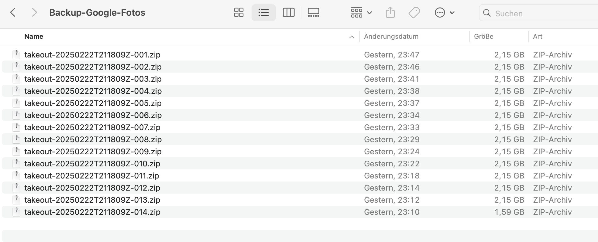

# Google Takeout Metadata Fixer

## Overview
This Python script extracts images from Google Takeout ZIP files and restores their metadata (EXIF data) using the corresponding supplemental JSON metadata files.

## Features
- Recursively extracts all ZIP files containing Google Takeout images.
- Searches for matching JSON metadata files.
- Restores:
  - **Original timestamp** (DateTimeOriginal, DateTimeDigitized)
  - **GPS coordinates** (if available)
  - **Description/User Comment**
- Saves the images with updated EXIF metadata.

## Installation

Clone this repository:

``` sh
git clone https://github.com/yourusername/google-takeout-metadata-restorer.git
cd google-takeout-metadata-restorer
```
Install dependencies:

```sh
pip install -r requirements.txt
```


## Prerequirements

Create a backup using google takeout. Save all ZIP files in a folder in which the script is executed.

Google Takeout: [https://takeout.google.com/settings/takeout](https://takeout.google.com/settings/takeout)




## Usage

Run the script and provide the path to your Google Takeout ZIP folder:

```sh
python restore_metadata.py
```

When prompted, enter the directory containing your Google Takeout ZIP files. The script will:

1. Extract all ZIP files into takeout_unpacked.
2. Scan for images and their corresponding metadata files.
3. Restore metadata and save the modified images.

## Example

```javascript
Enter the path to the folder with the ZIP files: /Users/username/Downloads/Takeout
📦 Unpacking ZIP files...
🖼️ Editing images...
✅ Metadata successfully restored!
```

## How It Works

1. Extracts ZIP files:

    * Uses zipfile to extract all ZIPs into takeout_unpacked.

2. Finds matching metadata:

    * Searches for *.supplemental-metadata.json files that correspond to images.

3. Restores metadata:

    * Sets original timestamp (DateTimeOriginal, DateTimeDigitized).
    * Applies GPS coordinates if available.
    * Adds the description as a user comment.

4. Saves the image with updated EXIF data.

## Troubleshooting

* EXIF metadata not updating?
    * Ensure your images have editable EXIF data (JPEG format recommended).
* Verify that metadata JSON files exist and contain photoTakenTime.

* Images missing?
    * Ensure the ZIP extraction was successful.
    * Run ```find . -name "*.supplemental-metadata.json"``` to check metadata files.

